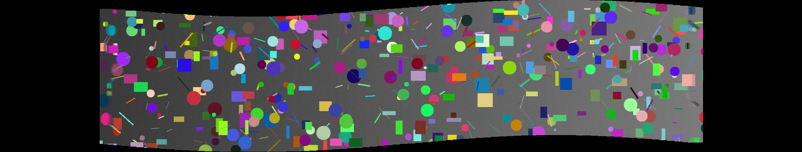

# Stereo Mosaicing

Generate a stereo panoramic video from a single video sequence captured by a
moving camera, using **manifold mosaicing** and Lucas-Kanade optical flow.

Unlike traditional image stitching (which assumes a single viewpoint via
homography), manifold mosaicing slices narrow vertical strips from different
horizontal positions within each source frame and stitches them onto a global
canvas. Sampling strips from the left side of source frames produces a
right-eye view; sampling from the right side produces a left-eye view. Animating
the slit position back and forth creates a "wiggle stereo" effect from a single
monocular camera.

## Demo

The repo is fully self-contained: `generate_demo.py` builds a wide, richly
textured synthetic scene, pans a viewport across it to fake a moving-camera
clip, and runs the mosaicing pipeline on it — no external footage needed.

```bash
pip install -r requirements.txt
python generate_demo.py        # writes videos/demo_input.mp4, demo_result.mp4, panorama_still.png
```

A single stitched panorama frame (the full clip is `videos/demo_result.mp4`):



The slight vertical curvature is the accumulated handheld Y-jitter being mapped
onto the global canvas.

## Algorithm

For each consecutive frame pair `(I_{t-1}, I_t)`:

1. Convert to grayscale.
2. Detect corners in `I_{t-1}` with `cv2.goodFeaturesToTrack`.
3. Track them into `I_t` with Lucas-Kanade pyramidal optical flow (`cv2.calcOpticalFlowPyrLK`).
4. Take the **median** flow vector as the global rigid translation `(dx, dy)` — robust to outliers.

The full per-frame trajectory is smoothed with a length-5 box filter to remove
handheld jitter, then accumulated to give each frame an absolute position on the
global canvas. To synthesize each output frame, a vertical slit at horizontal
position `x` is swept across the source image; for every input frame the strip
around that slit is copied onto the canvas, weighted by a 5-pixel linear feather
mask to hide seams. Strip width is set dynamically from camera speed
(`|dx| + 10`) to prevent gaps during fast motion.

Two preprocessing helpers handle real-world videos:

- `crop_letterbox` — detects solid-black borders by column variance and
  intensity and crops them out. Without this, feature detectors latch onto the
  static border edge and the median flow collapses to zero.
- `detect_orientation` — measures total horizontal vs. vertical motion across
  the first 30 frames and rotates the video 90° if the camera was panning
  vertically.

## Usage on your own footage

```python
from mosaic import generate_panorama
import mediapy

# input_frames_path is a directory of frames named frame_00000.jpg, frame_00001.jpg, ...
frames = generate_panorama("path/to/frames", n_out_frames=30)
mediapy.write_video("stereo_output.mp4", [f for f in frames], fps=10)
```

To go from an `.mp4` to the expected frame directory, use `ffmpeg`:

```bash
mkdir frames && ffmpeg -i input.mp4 frames/frame_%05d.jpg
```

## Implementation notes

- **Language:** Python 3
- **Core libraries:** OpenCV (feature detection, optical flow, rotation), NumPy
  (canvas accumulation), PIL (image I/O)
- The manifold mosaicing core (canvas mapping, strip slicing, feathering) is
  implemented from scratch in `mosaic.py`.

## Limitations

The algorithm assumes near-pure horizontal (or vertical) **translational**
camera motion. It produces visible distortion when the camera rotates, moves
forward/backward, or changes scale: objects at different depths shift at
different speeds and a single 2D translation per frame can no longer align the
scene.

## Note

This started as a university image-processing assignment. The mosaicing code in
`mosaic.py` is my own; the original course test videos have been replaced with
the self-contained synthetic clip generated by `generate_demo.py`.
